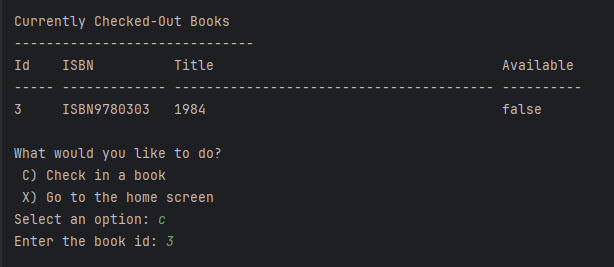

# Neighborhood Free Library

This is an example of what a workshop project should look like. It should have a README file that describes the project, with screenshots, and some code snippets. Your code snippets should show me your thought process of how you built your application.

The neighborhood free library is just that. A free, on-your-honor system, library where anyone can check out books to read.

There are currently 20 books available for customers to choose from. You can use the application to list all available books, or list those that are currently checked out.

## Screenshots




## Code Snippets

I created 3 different classes for this project.

The `Book` class defines the information that I need to keep track of for each book.

```java
    private int id;
    private String isbn;
    private String title;
    private boolean isCheckedOut;
    private String checkedOutTo;
```

The `LibraryApplication` class was responsible to keep track of the array of books, and it managed the basic flow of the application.

The`UserInterface` class contains all of the logic to interact with the user.

To reduce duplication of code I created 1 method to display a list of books, and I passed in a variable 

```java
    private void displayBooks(Book[] books, boolean isCheckedOut)
    {
        System.out.printf("%-5s %-13s %-40s %s\n","Id", "ISBN","Title", "Available");
        System.out.printf("%-5s %-13s %-40s %s\n","-".repeat(5), "-".repeat(13),"-".repeat(40), "-".repeat(10));

        for(Book book : books)
        {
            if(book.isCheckedOut() == isCheckedOut)
            {
                System.out.printf("%-5d %-13s %-40s %s\n",
                        book.getId(),
                        book.getIsbn(),
                        book.getTitle(),
                        !book.isCheckedOut());
            }
        }
    }
```
